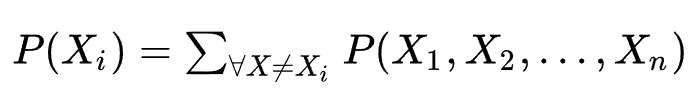

Неплохой разбор здесь 
https://www.youtube.com/watch?v=lMShR1vjbUo&t=2364s

Мы максимизируем Marginal Loglikelihood
$$log P(X|\theta) \rightarrow \max$$

 

## Definitions

#### Маржинальное распределение
Агрегированное по некоторой переменной, в данной случае по неизвестной нам $Z$

Интерпретация: размазали масло по плоскости (complete distribution), а потом сгребли его к одному краю (marginal). На выходе тоже распределение (суммируется в 1.0), но уже по одной переменной вместо двух

#### Likelihood
Правдоподобие = вероятность реализации выборки $x$ в предположении, что выбрана модель $\theta$

$$L(\theta) = P(x|\theta)$$

Используется также в Байесовской интерпретации, когда параметр модели воспринимается как случайная величина. В этом случае мы можем не только найти argmax L, но и посчитать апостериорное распределение параметра

$$P(\theta|x) = \frac{P(x|\theta)P(\theta)}{P(x)} = \frac{likelihood \cdot prior}{marginal}$$

#### Definition MLE
Maximum Likelihood Estimation - чтобы выбрать модель, вероятнее всего сгенерировавшую наблюдаемые данные, ищут $$\theta = argmax \{ L(\theta) \}$$

#### Definition Marginal Likelihood
Маржинальное правдоподобие - термин из Байесовской статистики. Это скаляр, равный правдоподобию $L(\theta)$, взвешенному по распределению параметра $\theta$ (в Байесовской постановке модель - это распредлеение, а не значение)

$$L = P(x) = \sum_z P(z) \cdot P(x|z,\theta)$$

Здесь $P(x,z)$ агрегируем до $P(x)$

Почему максимизацируем именно его? Потом что больше нечего

# EM: Подробный вывод

В обычном MLE делаем
$$\theta = \underset{\theta}{\mathrm{argmax}} P(X|\theta)$$

Там мы заменяем $P(X|\theta)$ на формулу подсчета вероятности в рамках выбранной модели (например, Гауссианы), а также наблюдаемые данные $X$ и получается функция от $\theta$, которую обычно легко оптимизировать.

Здесь же есть ненаблюдаемые переменные $X = (X,Z)$, поэтому такое не получится (нечего подставлять вместо X). То есть оптимизировать нужно функцию уже двух переменных $Z$ и $\theta$ 
$$\theta = \underset{\theta}{\mathrm{argmax}} P(X,Z|\theta)$$

Можно разложить так $P(X,Z)= P(Z) \cdot P(X|Z)$ и вероятность $P(X|Z)$ даже легко посчитать, но дело в том, что Z - не точечная оценка. Значению X могут соотвествовать разные Z 

$$P(X)= \sum_{Z} P(Z) \cdot P(Z|X)$$. 

То есть нам придется оптимизировать функционал в условиях Байесовского знания о Z - не точечной оценке, но предположения о его распределении $q(z)$.

Поэтому EM обычно формулируют, как задачу оптимизации маржинального распределения (усредненного по всем возможным Z):

$$P(x|\theta) \rightarrow \max$$

Считать сложно, поэтому считают обычно приближенно. Один из вариантов = EM

-----

Основное свойство маржинального распределения P(x) - для любых $q(z)$ и $\theta$ его всегда можно оценить снизу:

$$p(x|\theta) \geqslant \underbrace{\sum q(z) \log \frac{p(x,z)}{q(z)}}_{L(q, \theta)}$$

Эту штуку принято называть $L(q,\theta)$ или ELBO (evidence lower bound). И это главное выражение семейства подходов, которое называют Variational Bayes.

План такой - будем поочередно выбирать $q(z)$ и $\theta$ так, чтобы пошагово приближаться к оптимуму $p(x|\theta)$
- сначала выбираем q, который максимизирует правдоподобие при заданном $\theta$ (спойлер - это делается аналитически)
- выбираем модель $\theta$, которая улучшает ELBO при заданном $q(z)$

-----

Для начала докажем основное свойство. По определению маржинального правдоподобия:

$$\log P(x|\theta) = \log \bigg( \sum_{z} P(x,z|\theta) \bigg)$$

Взвесим на q(z) и применим неравенство Йенсена:

$$\log P(x|\theta) = \log \bigg( \sum_{z} q(z) \cdot \frac{P(x,z|\theta)}{q(z)} \bigg) \geqslant  \sum_{z} q(z) \cdot \log \bigg( \frac{P(x,z|\theta)}{q(z)} \bigg)$$

Свойство доказано

-----

Покажем, что есть один q(z), который максимизирует наш ELBO,а именно $q^{*} = p(z|x)$. 

Для этого перейдем от $p(x,z)$ в знаменателе к $p(z|x)$:

$$p(x,z) = \sum p(z|x) \cdot p(x)$$

Оценка разложится на два слагаемых:

$$L(q,\theta) = \underbrace{\sum_{z} q(z) \cdot \log \bigg( \frac{P(z|x,\theta)}{q(z)} \bigg)}_{-D_{KL}} + \underbrace{\sum_{z} q(z) \cdot \log  p(x|\theta)}_{\log p(x|\theta)}$$

Второе слагаемое - просто взвешивание константы (там нет z), поэтому оно равно $\log p(x|\theta)$

Тогда можем переписать:

$$L(q, \theta) = \log p(x) - D_{KL} $$

$$\log p(x) = L(q, \theta) + D_{KL} $$

Мы помним, что всякая $D_{KL} \geqslant 0$, а это значит зазор между оценкой $L(q,\theta)$ и $\log p(x)$ как раз содержится в дивергенции $D_{KL}$

Это значит, что максимум достигается при $D_{KL} = 0$, то есть $q^{*} = p(z|x)$

Мы нашли оценку неизвестной перемнной $q(z)$, при которой в рамках модели \theta данные наиболее правдоподобны

Нет гарантии, что $\theta$ оптимальный выбор модели. Второй шаг делаем по переменной $\theta$ при фиксированном знании $q*$

$$\theta^{*} = \underset{\theta}{\mathrm{argmax}} \big\{ L(q^{*}, \theta) \big\} = \underset{\theta}{\mathrm{argmax}} \bigg\{ \sum_z q^{*} \cdot \log \frac{p(x,z)}{q^{*}} \bigg\} = $$

Знаменатель не зависит от $\theta$, его выкидываем:

$$\theta = \underset{\theta}{\mathrm{argmax}} \bigg\{ \sum q^{*} \cdot \log p(x,z|\theta) \bigg\}\ = \underset{\theta}{\mathrm{argmax}} E_{q^{*}} \big[ \log p(x,z|\theta) \big] $$

Мы нашли новый параметр $\theta$, который улучшает нашу нижнюю границу $L(q, \theta)$, а значит и само правдоподобие $\log p(x|\theta)$

Еще раз резюмируя алгоритм:

 1) в рамках выбранной модели $\theta$ подбираем знание о распределении z такое, чтобы ELBO лучше всего приближала искомое правдоподобие $p(x|\theta)$: 

$$Q(\Theta|\Theta_{current}) = E_{Z|X,\Theta_{current}} logP(X|Z,\Theta)$$

2) с учетом текущего знания о распределении $z$ подбираем модель $\theta$ максимизирующую среднее правдоподобие P(x,z): 

$$\Theta_{new} = \underset{\theta}{\mathrm{argmax}} Q(\Theta)$$

Повторяем до сходимости $$\Theta_0, \Theta_1 \cdots \Theta_n \rightarrow \Theta_{opt}$$

## Приложения
Всё, где есть латентные переменные. Грубо - все генеративные модели
- K-means
- Gaussian Mix Models
- Topic Modeling
- Hidden Markov Models

### Почему Байесовской статистика

Потому что работаем не с точечными оценками $Z$, а имеем дело с априорным предположением о распредлеении $Z$

# Теоретическая обоснованность алгоритма

Функцию правдоподобия можно оценить снизу:

$$L(\theta) = logP(X|\theta) \ge E_{Z|X} logP(X,Z) + H(X) = ELBO$$ 

ELBO = Evidence Lower Bound

Схема работы алгоритма показана на картинке ниже:
- красная линия - искомая функция правдоподобия (нам не видна)
- синяя - ELBO для первой оценки
- зеленая - ELBO для второй оценки

# K-means как EM

### Дано 
Некоторая выборка на плоскости, состоящая из N точек

    
Принадлежность точки классу определяется латентной переменной $Z=(z_1 \cdots z_N)$. Считаем, что в ней представлены данные 3 классов и $z \in \{'red','blue','green'\}$. То есть вектор **Z** - это раскраска множества точек выборки в 3 цвета. 
    
Параметры $\Theta = (\theta_1, \theta_2, \theta_3)$ характеризуют центры распределения каждого из классов $\{x|x \in X_1\},\{x|x \in X_2\},\{x|x \in X_3\}$. Раскраска в k-means однозначно опредлеяется параметрами $\Theta$.

### Задача
Определить оптимальный набор $\Theta$, который наиболее правдоподобно описывает данные. Раскраска (Z) тогда будет рассчитана автоматически и должна выглядеть примерно так:

### Алгоритм

#### 0. Initialization

Берем некий начальный параметр $\Theta_0$. Значения латентной переменной **Z** зависят от $\Theta$: чем ближе точка к центру кластера, тем больше веротяность этого кластера $P(Z|\Theta)$, 

#### 1 Expectation

$E_{Z|X,\Theta}logP(X,Z) = \sum P(Z|X,\Theta_0)logP(X|Z,\Theta)$

- $Z|X\Theta$

    Смотрим условное распределение вероятности латентных переменных Z при фиксированном $\Theta$: $$P(Z|X,\Theta)$$

    Для начала посчитаем $P(z_i|x_i,\Theta)$ для отдельной точки - она могла быть сгенерирована из любого из трех классов, поэтому ее приндлежность - апостериорная веротяность, которая рассчитывается по теореме Байеса, как взвешенная сумма правдоподобий каждого класса.

    Далее $P(Z|X,\Theta)$ считается как произведение $P(z_i|x_i,\Theta)$

    Соджержательно это ответ на вопрос - Как распределены значения латентных переменных (разделение на классы) при заданном $\Theta$
    

- $log P(X|Z,\Theta)$

    Смотрим правдоподобие выборки $X$ при данных $Z$ и $\Theta$. То есть при заданной раскраске $Z$ и заданных распределениях $\Theta$, какова веротяность наблюдать данную выборку.

- $E(\Theta)$

    

Далее, так как k-means это у нас пример hard-clustering, то мы дальше мы работаем не с распределением, а берем наиболее вероятный набор значений. Он легко определяется без особой математики - всё  что ближе к центру кластера X, относится к кластеру X.

#### 2. Maximization 

Теперь фиксируем Z, который мы нашли на предыдущем шаге, и корректируем параметр $\Theta$. 

Выбираем на плоскости такие центры распределения, которые лучше всего описывают текущие значения Z. Лучше всего = правдоподобие $P(X|Z,\Theta)$ наибольшее.\

# GMM как EM

Он же soft-clustering
