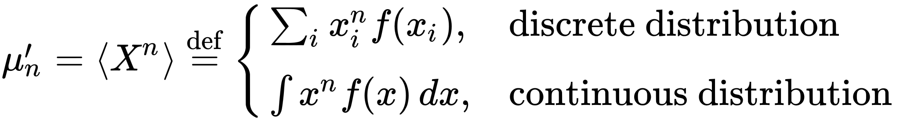
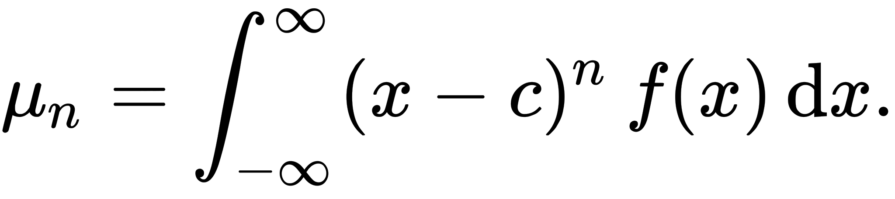
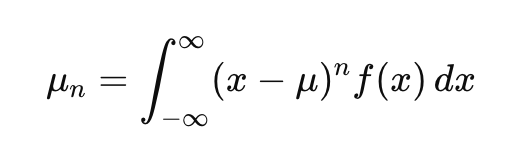
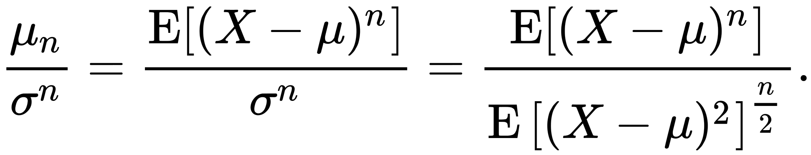
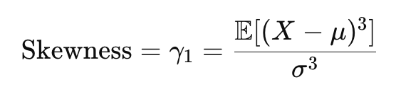
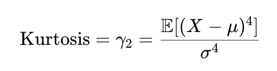
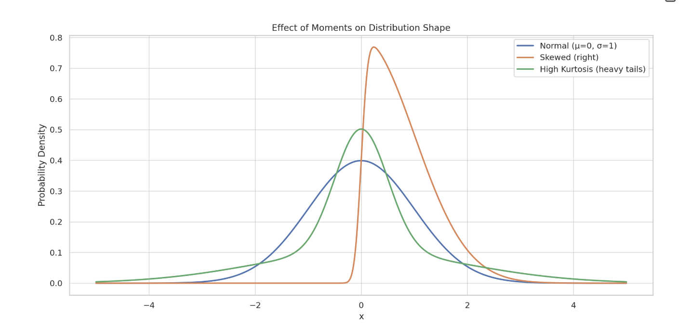
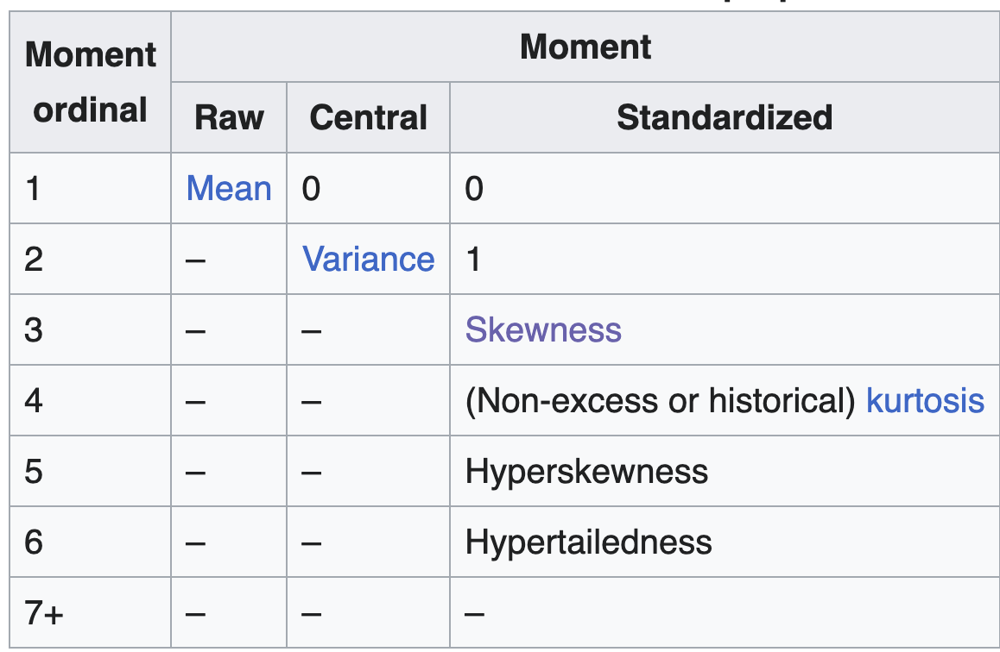

# Distribution Moments

Moment of a function is a measure of the function shape 

In probability theory it is a statistic over the variable distribution - see definitions below

__Raw moment__ is a weighted by PDF power of the argument

 

__Moment about c__ is a moment with shifted argument

 

__Central moment__ is a moment around its mean

 

__Standardized moment__ is a moment divided by the power of its second moment

 

## Etimology

## Main Moments

|N|Moment|Measures what|
|---|---|---|
|1st Raw|Mean|Center of Mass|
|2nd Central|Variance|Distribution|
|3rd Central|Skewness|Assymetry|
|4th Central|Kurtosis|Tail-heaviness/peakedness|

### Skewness

Skewness measures an expected deviation around the mean (raised to 3rd power)  It is normalized by the same power of standard deviation to make it scale-invariant.

- Since there is a third (odd) power any assymetry in the distribution contributes to the final measure. This is what Skewness supposed to measure 
- Skewness can be negative depending on the assymetry direction

### Kurtosis

Kurtosis measures an expected deviation around the mean (raised to 4rd power)  It is normalized by the same power of standard deviation to make it scale-invariant.

- Since there is a fourth (even) power heavy tails from both sides contribute the most to the final output 

Comparison of shapes with respect to distribution moments

### Higher order moments

In theory there are much more momemnts that exist

## Usage

Method of moments = equalize analytic and sample expressions for the moments and solve this system oif equations

Alternative to Maximum Likelihood estimation

